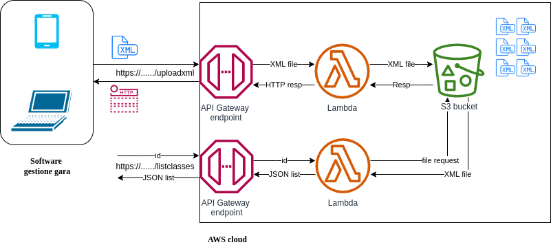
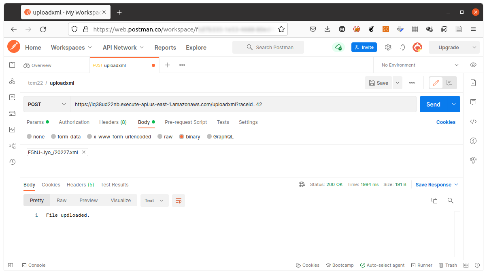

# Homework 2

## Consegna

1. Implementazione scheletro architettura cloud

    

2. Come gestire più gare (quindi più file)?
3. Come evitare che utenti non autorizzati carichino file?
4. Integrare AWS DynamoDB per gestire le informazioni relative alle gare (id univoco) e collegamento con i file su S3
5. BONUS: Software locale che “simula” una gara, cioè legge XML e genera file XML che contiene solo i dati disponibili dopo X minuti dalla partenza della gara


## Soluzione proposta

### 1. Implementazione scheletro architettura cloud

Premesse: fare il login su AWS attraverso la classe AWS Academy oppure con il proprio account privato. Si sceglie la regione `us-east-1`. La lingua dell'interfaccia di AWS è impostata su *English (US)*.

#### 1.1 Configurare Bucket S3

1. Entrare nella console AWS S3: https://s3.console.aws.amazon.com/s3/buckets
2. Creare un nuovo bucket. Segliere un nome (nel mio caso `mdv-xmlresults-bucket`), una regione (`us-east-1`) e lasciare le altre impostazioni di default.


#### 1.2 Creare la Lambda function per l'upload del file

1. Entrare nella console AWS Lambda: https://us-east-1.console.aws.amazon.com/lambda

2. Creare la funzione per l'upload dell'XML (Lambda > Functions > Create Function).

    Scegliere "Author from scratch", impostare il nome della funzione come `uploadxml`.
    
    Scegliere il runtime di preferenza. Nell'esempio di codice si utilizza una Lambda scritta in Python, quindi si seleziona **Python 3.9**.

    Selezionare l'utente interno AWS che esegue la funzione. Se si usa la classe AWS academy, basta selezionare il ruolo predefinito **LabRole**. Altrimenti bisogna creare un ruolo attraverso *AWS Identity and Access Management (IAM)*.
    Change default execution role > Use an existing role > LabRole.

3. Scrivere il codice della funzione. Si veda l'esempio [lambda/uploadxml.py](lambda/uploadxml.py).

4. Fare il **deploy**.


#### 1.3 Creare l'endpoint API con API Gateway

1. Entrare nella console AWS API Gateway https://us-east-1.console.aws.amazon.com/apigateway

2. Creare una nuova API: APIs > Create API > HTTP API > Build

    Scegliere un nome (es. *myapi*). Impostare un *Integrations* con la Lambda appena creata.
    Assicurarsi che la Version della Integration con la Lambda sia **2.0**.

    Configurare la route (endpoint). Method: ANY, Resource path: /uploadxml, Integration target: uploadxml.

    Lasciare tutto il resto come di default.

3. Nella console di dettaglio dell'API appena creta trovare l'*Invoke URL* pubblico. Nel mio caso: https://lq38ud22nb.execute-api.us-east-1.amazonaws.com/


#### 1.4 Testare il funzionamento

1. Provare a chiamare la funzione con il metodo HTTP GET inserendo come indirizzo del browser:
https://lq38ud22nb.execute-api.us-east-1.amazonaws.com/uploadxml. Se tutto OK si avrà come risposta *"Ciao from Lambda!"*.

2. In ogni caso, ma specialmente in caso di errore, controllare il log della Lambda.

    Lambda > Functions > uploadxml

    Monitor > Logs

3. Testare il funzionamento del metodo POST con l'aiuto di [Postman](https://www.postman.com/) o software simile.

    

    Inserire nel Body della richiesta il contenuto di uno dei [file XML di esempio](../xml_di_prova/).

    Inserire nell'URL della richiesta il parametro `raceid=N`, con N qualsiasi.

4. In caso di successo verificare che il file XML sia presente nel bucket S3, altrimenti visionare il log (vedi punto 2).

#### 1.5 Creare la Lambda function e l'endpoint API per ottenere la lista delle categorie

1. Procedere in modo analogo alla funzione precedentemente creata. Il codice di esempio è in [lambda/listclasses.py](lambda/listclasses.py)

2. Collegare la nuova lambda function a un nuovo endpoint (Develop > Routes > Create) della API precedentemente creata. (nota: non è necessario creare una nuova API).

    Scegliere il solo metodo GET e `/list_classes` come route.

    Configurare la *Integration* per la nuova route `/list_classes` da Develop > Integrations > Create and attach integration

3. Testare il funzionamento con chiamate tipo:
    
    https://lq38ud22nb.execute-api.us-east-1.amazonaws.com/listclasses?id=42

    Nota: la chiamata si può fare direttamente dal browser, trattandosi di una GET.
    Alternativamente si può utilizzare ancora Postman.

    Esempio di output atteso per il file di esempio [ResultList1.xml](../xml_di_prova/ResultList1.xml):

    ```
    ["Men Elite", "Open"]
    ```


### 2. Come gestire più gare?

La soluzione proposta permette già la gestione di più gare: ciascuna gara avrà il suo ID univoco.

### 3. Come evitare che utenti non autorizzati carichino file?

Una soluzione semplice può essere assegnare un **token** (cioè una stringa "segreta") all'utente in fase di registrazione della gara e poi utilizzare il token **invece** del parametro *raceid* nell'endpoint `/uploadxml`. Es: https://.../uploadxml?authtoken=

Sarà necessario:

1. Realizzare una funzionalità di **registrazione della gara** nel sistema in cui l'utente fornisce alcune informazioni (es. nome gara, data evento, email, ...) e riceve in risposta un ID (che sarà pubblico e utilizzato da tutti per visualizzare i risultati) e token (che dovrà usare, solo lui, per caricare i file).

2. Memorizzare l'abbinamento raceid-token da qualche parte, per esempio dentro un database **AWS DynamoDB**.

### 4. Integrare AWS DynamoDB per gestire le informazioni relative alle gare (id univoco) e collegamento con i file su S3

1. Entrare nella console AWS DynamoDB https://us-east-1.console.aws.amazon.com/dynamodbv2

2. Creare una nuova tabella con DynamoDB > Tables > Create table.

    Specificare il nome della tabella (es. *raceinfo*) e la chiave primaria (es. *id*).

    Attendere la fine della creazione della tabella.

3. Creare un item di prova nella tabella (Actions > Create item). Aggiungendo gli attributi name, date, token, email. Scegliere opportunamente il tipo di dato per ciascun attributo.